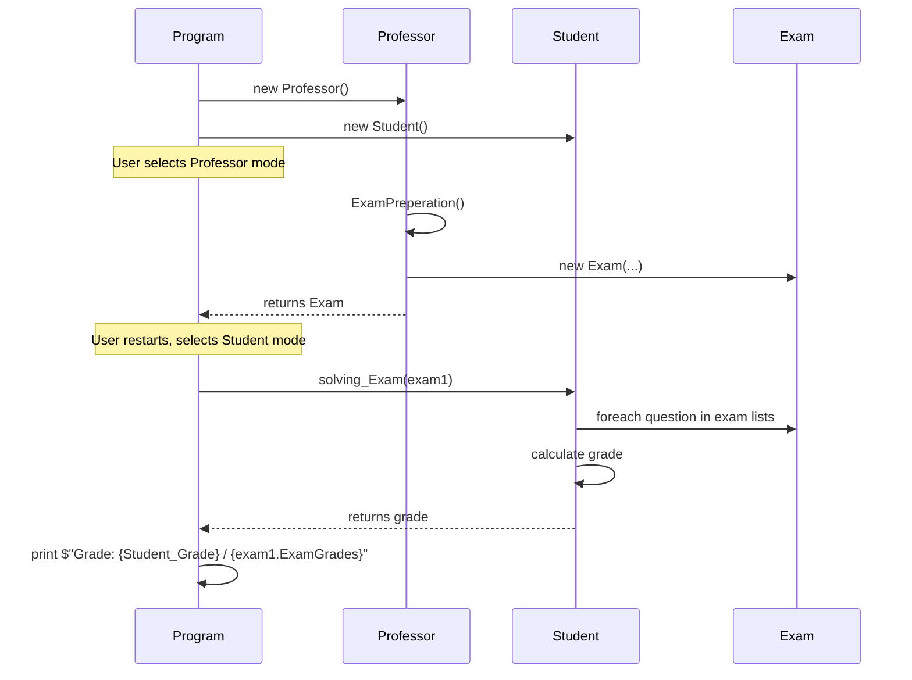

# Object-Oriented Design (OOD) for Exam Preparation System

## Overview
C# console app for exam creation (Professor) and solving (Student). Core entities:
- **Question** (abstract/base): Common properties (ID, type, text, level, grade).
- **True_False_Question**, **ChoiceQuestion**, **MultiChoiceQuestion**: Specialized questions.
- **Exam**: Composes lists of all question types + ID, total grades.
- **Professor**: Creates Exam via interactive input.
- **Student**: Solves Exam, calculates grade.
- **Program**: Entry point, mode selection.

## Key Relationships
- **Composition**: Exam contains `List<True_False_Question>`, `List<ChoiceQuestion>`, `List<MultiChoiceQuestion>`.
- **Usage**: Professor.ExamPreperation() → Exam
- **Usage**: Student.solving_Exam(Exam) → int grade
- **Inheritance**: Question subtypes extend Question functionality.

## Class Diagram (Mermaid)
```mermaid
classDiagram
    class Question {
        -string q_id
        +enQuestionType typeOfQuestion
        +enQuestionLevel QuestionLevel
        +string question
        +int GradeOfTheQuestion
        +Question(string, enQuestionType, string, enQuestionLevel, int)
    }
    
    class True_False_Question {
        +bool CorrectAnswer
        +True_False_Question(string, enQuestionType, string, enQuestionLevel, int, bool)
    }
    
    class ChoiceQuestion {
        +List~string~ options
        +int correctAnswer
        +ChoiceQuestion(string, enQuestionType, string, enQuestionLevel, List~string~, int, int)
        +PrintOptions()
    }
    
    class MultiChoiceQuestion {
        +List~string~ options
        +List~int~ CorrectAnswers
        +MultiChoiceQuestion(string, enQuestionType, string, enQuestionLevel, int, List~string~, List~int~)
        +Printoptions()
    }
    
    class Exam {
        -string Exam_id
        +int ExamGrades
        +List~True_False_Question~ true_False_Questions
        +List~ChoiceQuestion~ choiceQuestions
        +List~MultiChoiceQuestion~ multiChoiceQuestions
        +Exam(string, int, List~True_False_Question~, List~ChoiceQuestion~, List~MultiChoiceQuestion~)
    }
    
    class Professor {
        -string prof_id
        +string prof_Name
        +Professor(string, string)
        +Exam ExamPreperation()
        +static Print_QuestionType()
        +static Print_QuestionLevel()
    }
    
    class Student {
        +string student_id
        +string student_Name
        +Student(string, string)
        +int solving_Exam(Exam)
        +int solveExam()
    }
    
    class Program {
        +static Main()
        +static ExamMode()
    }
    
    Exam ||--o{ True_False_Question : contains
    Exam ||--o{ ChoiceQuestion : contains
    Exam ||--o{ MultiChoiceQuestion : contains
    True_False_Question --|> Question
    ChoiceQuestion --|> Question
    MultiChoiceQuestion --|> Question
    Professor ..> Exam : creates
    Student ..> Exam : solves
```

## Sequence Diagram: Professor Creates Exam → Student Solves


**Notes:**
- Enums: `enQuestionType` (TrueFalse=1, SingleChoice=2, MultiChoice=3), `enQuestionLevel` (Easy=1, Medium=2, Hard=3).
- Namespaces: ExamSystem.* (Question.*, Exam, proffessor, student).
- Improvements: Abstract Question class, polymorphism for printing/solving, input validation.

Open OOD.md in VSCode Markdown preview to render diagrams interactively.
